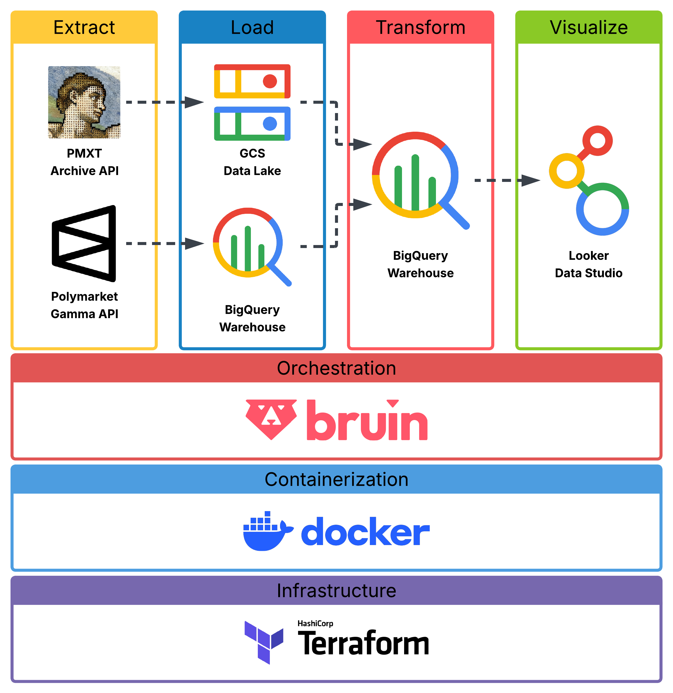
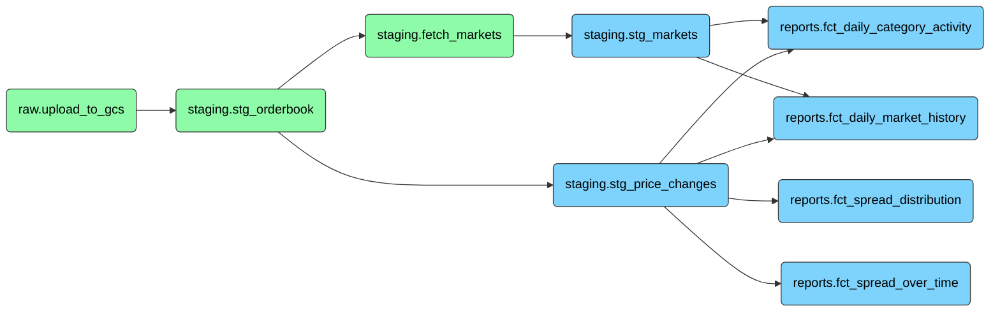
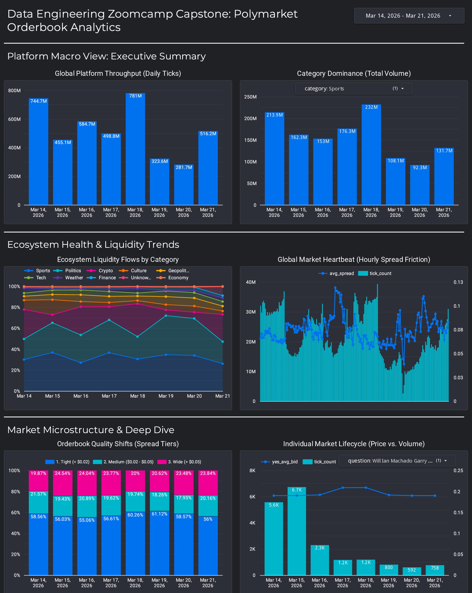
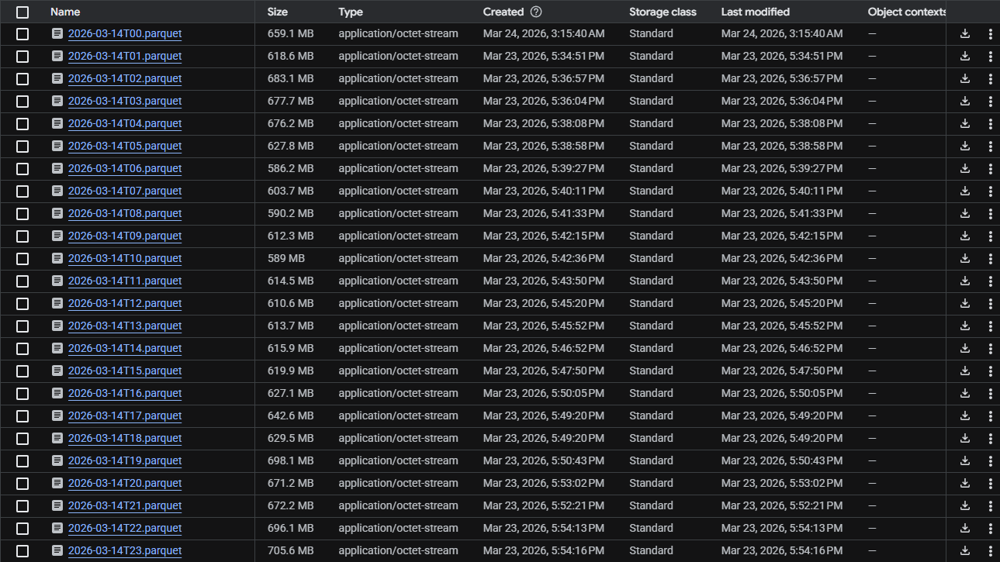

# 📊 Polymarket Pulse

An incremental batch pipeline that ingests, transforms, and visualizes Polymarket orderbook data to surface liquidity patterns, market sentiment, and trading activity across prediction market categories.

---

## 📋 Table of Contents

- [Problem Statement](#problem-statement)
- [Engineering Challenges & Design Decisions](#engineering-challenges--design-decisions)
- [Architecture](#architecture)
- [Technologies](#technologies)
- [Why BigQuery Instead of Spark?](#why-bigquery-instead-of-spark)
- [Dataset & Data Structure](#dataset--data-structure)
- [Pipeline Overview](#pipeline-overview)
- [Data Warehouse Design](#data-warehouse-design)
- [Dashboard](#dashboard)
- [Project Structure](#project-structure)
- [Cost & Scale Warning](#cost--scale-warning)
- [Cloud Setup (from scratch)](#cloud-setup-from-scratch)
- [Running Locally (clone & run)](#running-locally-clone--run)
- [Makefile](#makefile)
- [Reproducibility](#reproducibility)

---

## Problem Statement

Polymarket is a decentralized prediction market platform where users trade on real-world outcomes. Every price change in those markets produces an orderbook tick — a bid/ask pair that encodes the crowd's real-money belief about an event's probability at a given moment.

The raw data exists but is hard to reason about at scale: it arrives as hourly Parquet files, all pricing information is buried inside a nested JSON payload column, and markets have no category metadata attached at the source.

This project builds an end-to-end batch data pipeline that:

- Pulls raw hourly orderbook Parquet files from a public archive (https://r2.pmxt.dev)
- Lands them in a GCS data lake, partitioned by date
- Ingests them into BigQuery with partition-level idempotency
- Parses the nested JSON payload and transforms it into typed, structured fact tables
- Enriches each market with metadata (category, event title, resolution status) via the Polymarket Gamma API
- Powers a Looker Studio dashboard that answers two core questions:
  - **Where is activity concentrated?** Category-level market counts, tick volumes, and average spreads by day
  - **How liquid is the platform?** Hourly spread time series and spread-tier distribution over time

---

## Engineering Challenges & Design Decisions

Building this pipeline surfaced a set of real data engineering problems that shaped almost every technical decision made.

### The nested JSON problem

The raw orderbook data stores all pricing fields — `best_bid`, `best_ask`, `side`, `token_id`, `change_size` — inside a single `data` column as a JSON string. This is a deliberate design at the source: the archive publishes a generic schema (`market_id`, `update_type`, `data`) to accommodate multiple event types (`price_change`, `book_snapshot`) without versioning complications. The cost is that every downstream consumer must parse that JSON themselves.

Rather than materializing parsed fields in a staging Python asset, the parsing is done in BigQuery SQL using `JSON_VALUE()` at the `stg_price_changes` layer. This keeps the raw layer untouched and lets BigQuery push down the `update_type = 'price_change'` filter before scanning the JSON — avoiding any wasted parsing on `book_snapshot` rows.

### Backfilling without re-downloading

The pipeline needed to support both daily runs (single date) and arbitrary multi-day backfills. The naive approach — checking whether data exists before each run — would require either trusting an external state store or scanning BigQuery on every invocation.

The solution is partition-level idempotency at every layer. GCS uploads skip blobs that already exist. The BigQuery load uses `LOAD DATA INTO ... OVERWRITE PARTITIONS`, which atomically replaces exactly the target date partition regardless of what was there before. Report tables use `delete+insert` scoped to `[start_date, end_date)`. Rerunning any date range is always safe.

### The missing category problem

Polymarket's public API does not return a reliable `category` field on most markets. Markets belong to *events*, events belong to *series*, and series have tags — but the tag taxonomy is inconsistent, the API sometimes returns empty tag lists, and tag IDs can mean different things depending on when a market was created.

The solution was to build a canonical tag mapping: a hardcoded priority list of 8 known tag IDs (Politics, Finance, Crypto, Sports, etc.) that are checked in order for each market. If none match, a fallback uses the first non-rewards tag label from the API response. Markets the API cannot resolve at all are written as "ghost" rows so that downstream joins don't silently drop ticks for unknown markets — preserving referential integrity across the entire fact layer.

### Orchestration using Bruin

This project uses Bruin to reduce the number of tools required to run the pipeline. Bruin replaces the traditional fragmented modern data stack by consolidating the entire data lifecycle into a single stateless CLI binary. Within a unified Git-native project, it natively manages:

- **Data Ingestion:** Extracts raw data from external APIs and sources directly into the warehouse, removing the need for standalone ingestion tools.

- **Data Transformation:** Cleans, models, and aggregates data by executing both SQL and Python assets seamlessly within the same pipeline.

- **Data Orchestration:** Resolves asset dependency graphs, handles incremental delete+insert strategies, and manages execution without a persistent scheduler process or Celery workers.

- **Data Quality:** Enforces built-in validation (e.g., bounds, accepted values, non-nulls) and custom SQL quality checks immediately upon asset materialization.

- **Metadata Management:** Automatically captures column-level lineage, tracks dependencies, and maintains documentation for full pipeline observability.

The entire end-to-end flow is simply executed via a `bruin run` command inside a Docker container on a cron job, eliminating the need for a complex, multi-tool infrastructure.

### Cost control on BigQuery on-demand pricing

BigQuery on-demand pricing bills per byte scanned. A pipeline that runs full-table scans every day against a growing orderbook table would produce unbounded costs. Every asset in this pipeline is designed to scan only the target date partition: all WHERE clauses filter on the partition column first, custom checks use `date >= DATE('{{ start_date }}')` instead of `COUNT(*) FROM full_table`, and clustering columns match the filter and join patterns of downstream queries.

### Credentials in a cloud-native environment

The pipeline runs inside a Docker container on a Compute VM. The container needs two files at runtime: `bruin_gcp.json` (the service account key) and `.bruin.yml` (the Bruin connection config). Baking either into the Docker image would embed credentials in a registry layer — a serious security risk. Storing them on the VM disk requires manual setup and breaks reproducibility.

Both files are stored in GCP Secret Manager and pulled at VM startup via `startup-script.sh`. The VM authenticates to Secret Manager using its attached service account identity (ADC), so no bootstrap credentials are needed. A new VM provisioned by Terraform is fully operational after a single `terraform apply`, with no manual file placement.

---

## Architecture



External source: `https://r2.pmxt.dev/polymarket_orderbook_{YYYY-MM-DDTHH}.parquet`

Polymarket Gamma API: `https://gamma-api.polymarket.com/markets`

---

## Technologies

| Layer                | Tool                                             | Notes                                                                                                                                                                                                                 |
| -------------------- | ------------------------------------------------ | --------------------------------------------------------------------------------------------------------------------------------------------------------------------------------------------------------------------- |
| **Cloud**            | Google Cloud Platform                            | GCS, BigQuery, Secret Manager, Compute Engine                                                                                                                                                                         |
| **IaC**              | Terraform                                        | Manages all GCP resources declaratively — bucket, datasets, VM, IAM bindings, secrets                                                                                                                                 |
| **Orchestration**    | [Bruin CLI](https://bruin-data.github.io/bruin/) | Asset-based pipeline orchestrator. Defines assets (SQL or Python), resolves the DAG, injects secrets, runs data quality checks, and handles incremental strategies natively — without a persistent scheduler process. |
| **Data Lake**        | Google Cloud Storage                             | Raw Parquet files partitioned by `date={YYYY-MM-DD}`                                                                                                                                                                  |
| **Data Warehouse**   | BigQuery                                         | Staging and reports datasets, serverless — no cluster management                                                                                                                                                      |
| **Transformations**  | Bruin SQL assets (BigQuery dialect)              | Incremental `delete+insert`, partitioned and clustered tables                                                                                                                                                         |
| **Containerization** | Docker + uv                                      | Reproducible runtime; uv manages the Python virtual environment via a lockfile                                                                                                                                        |
| **Dashboard**        | Looker Studio                                    | Connected directly to BigQuery report tables                                                                                                                                                                          |
| **Python env**       | [uv](https://github.com/astral-sh/uv)            | Fast, lock-file-based package manager — replaces pip + venv                                                                                                                                                           |

---

## Why BigQuery Instead of Spark?

The course covers Spark as the primary batch processing engine, and Spark would technically work here. But several properties of this specific pipeline make BigQuery the better fit:

**The transformation logic is SQL-native.** Every transformation in this pipeline — JSON parsing, type casting, aggregation, spread bucketing, Pearson correlation — maps naturally to SQL. Spark's main advantage (distributed in-memory processing with a rich DataFrame API) adds complexity without benefit when the logic is already expressible in clean SQL clauses.

**The data volume doesn't justify a cluster.** A full day of Polymarket orderbook data is on the order of tens of millions of rows. This is large enough that in-process Pandas would struggle, but well within the range where BigQuery's serverless engine handles it cheaply — without provisioning, sizing, or managing a Spark cluster.

**Operational simplicity.** Spark requires either a managed cluster (Dataproc, EMR) or a self-managed one, both of which add infrastructure to maintain, monitor, and pay for whether or not the pipeline is running. BigQuery is serverless: it bills per byte scanned, costs nothing when idle, and requires zero cluster management.

**Native integration with GCS and the rest of GCP.** The pipeline already lives on GCP. BigQuery reads directly from GCS Parquet files via `LOAD DATA`, connects natively to Looker Studio, and uses the same service account IAM model as every other resource in the project. Introducing Spark would add a separate auth surface and a separate data movement step.

**Cost predictability at this scale.** With aggressive partition pruning and clustering, every daily run scans only the target date's data. The per-query cost is small, deterministic, and controlled entirely by the WHERE clause — something that's harder to guarantee with Spark's execution model on on-demand infrastructure.

The one scenario where Spark would win is if this pipeline needed to run complex iterative algorithms (graph processing, ML feature engineering, multi-pass joins across massive denormalized tables) that BigQuery SQL cannot express efficiently. That is not this pipeline.

---

## Dataset & Data Structure

Raw data is sourced from the **pmxt Polymarket orderbook archive** — a public mirror that publishes hourly Parquet snapshots of all orderbook events on Polymarket.

- **URL pattern:** `https://r2.pmxt.dev/polymarket_orderbook_{YYYY-MM-DDTHH}.parquet`
- **Coverage:** Every hour since Polymarket launched
- **Schema:** `timestamp_received`, `timestamp_created_at`, `market_id`, `update_type`, `data` (JSON payload)
- **Market metadata:** Fetched on-demand from the [Polymarket Gamma API](https://gamma-api.polymarket.com/) (`/markets`, `/events/{id}/tags`)

### Raw data sample

This is what a raw row looks like after landing in `staging.stg_orderbook`. Note that all pricing information is buried inside the `data` JSON column — there are no typed price fields at this layer.

| Field                  | Example value                                                                                                                                                                          |
| ---------------------- | -------------------------------------------------------------------------------------------------------------------------------------------------------------------------------------- |
| `timestamp_received`   | `2026-03-14 00:02:01.696000 UTC`                                                                                                                                                       |
| `timestamp_created_at` | `2026-03-14 00:02:01.719000 UTC`                                                                                                                                                       |
| `market_id`            | `0x00000977017fa72fb6b1908ae694000d3b51f442c2552656b10bdbbfd16ff707`                                                                                                                   |
| `update_type`          | `price_change`                                                                                                                                                                         |
| `data`                 | `{"update_type": "price_change", "token_id": "44554...", "side": "YES", "best_bid": "0.014", "best_ask": "0.016", "change_price": "0.189", "change_size": "0", "change_side": "SELL"}` |

A few things to notice in this sample that directly informed pipeline design decisions:

- **`best_bid` and `best_ask` are strings, not floats.** Every cast must be explicit (`CAST(JSON_VALUE(data, '$.best_bid') AS FLOAT64)`), and any non-numeric garbage value will fail silently if not guarded. The `stg_price_changes` asset wraps all casts in explicit type checks before they reach aggregation.

- **Each market event produces two simultaneous ticks** — one for the YES token and one for the NO token (rows 1 and 2 in the raw sample share the same timestamp). Tick counts in aggregations naturally reflect both sides. If you want to measure "number of distinct market events," you must deduplicate or filter to a single `side`.

- **`change_size` can be `"0"`**, meaning the orderbook depth didn't change — only the best price moved. This is valid and meaningful data (it signals price discovery without a trade), and must not be filtered out.

- **Prices are probabilities**, bounded between 0 and 1. A `best_bid` of `0.014` means the market prices a ~1.4% chance of the YES outcome. The `stg_price_changes` asset enforces `[0, 1]` bounds as hard blocking checks.

- **The spread is derived, not stored.** `spread = best_ask - best_bid`. In the sample, the YES spread is `0.016 - 0.014 = 0.002` — a tight market. A spread above `0.05` is classified as "Wide" in the `fct_spread_distribution` tier logic. The pipeline also guards against inverted markets (`ask < bid`), which can appear in the raw data due to stale snapshots.

---

## Pipeline Overview

The pipeline is a **daily batch pipeline** orchestrated by Bruin. Each asset runs in dependency order. Here is the execution DAG:



### Asset descriptions

**`raw.upload_to_gcs`** — Python asset. Streams hourly Parquet files from the pmxt archive into GCS at `gs://polymarket-raw-parquet/raw/orderbook/date={date}/{hour}.parquet`. Skips blobs that already exist (idempotent). Runs up to 4 concurrent uploads. Exits non-zero if any slot fails, blocking all downstream assets from running on incomplete data.

**`staging.stg_orderbook`** — Python asset. Loads raw Parquet files from GCS into BigQuery via `LOAD DATA INTO ... OVERWRITE PARTITIONS`, one partition per date. Supports both daily runs and multi-day backfills. Partitioned by `DATE(timestamp_received)`, clustered by `market_id, update_type`.

**`staging.stg_price_changes`** — SQL asset. Parses and flattens the raw JSON `data` column using `JSON_VALUE()`, casts all fields to their correct types, derives `spread = best_ask - best_bid`, and applies strict data quality guards (probability bounds `[0,1]`, inverted market filter `ask >= bid`, side allowlist). Partitioned by `date`, clustered by `market_id`. Uses `delete+insert` incremental strategy.

**`staging.fetch_markets`** — Python asset. Fetches market metadata from the Polymarket Gamma API concurrently (8 threads, batches of 20). Resolves category tags via a canonical priority list of 8 known tag IDs. Upserts into `staging.dim_markets` via a temp table + `MERGE` (insert-only — existing rows are never overwritten). Markets the API cannot resolve are written as "ghost" rows to preserve referential integrity in downstream joins.

**`staging.stg_markets`** — SQL view over `dim_markets`. Filters ghost markets and applies `COALESCE` defaults for nullable fields. The primary dimension join key for all report assets.

**`reports.fct_spread_over_time`** — Hourly time-series of average spread, spread standard deviation, and tick count. Drives intraday liquidity and platform heartbeat charts.

**`reports.fct_spread_distribution`** — Buckets spreads into three quality tiers: Tight (`< $0.02`), Medium (`$0.02–$0.05`), Wide (`> $0.05`). Powers the 100% stacked bar chart for liquidity quality tracking.

**`reports.fct_daily_category_activity`** — Daily aggregation of distinct market count, tick volume, and average spread by category. Primary source for the Macro View dashboard tile.

**`reports.fct_daily_market_history`** — Daily snapshot per individual market: YES token price action, spread volatility (`STDDEV`), and a Pearson correlation of YES bid price against time as a sentiment proxy (`+1` = strong YES trend, `-1` = strong NO trend).

---

## Data Warehouse Design

### Partitioning & Clustering

All fact tables are **partitioned by `date`** so that each pipeline run only scans and mutates the target date range — not the full table. This is the primary cost control mechanism: BigQuery on-demand pricing charges per byte scanned, and without partitioning, every daily aggregation would scan the entire multi-month history.

Clustering is applied on top of partitioning where it improves the most common filter and join patterns:

- `stg_orderbook` → clustered by `market_id, update_type`: the `stg_price_changes` transform filters `update_type = 'price_change'` before grouping by `market_id`, so both columns act as pruning keys.
- `stg_price_changes` → clustered by `market_id`: all downstream joins use `market_id` as the join key.
- `fct_spread_over_time` → clustered by `hour`: dashboard queries typically filter to date ranges and specific hour windows.
- `fct_daily_category_activity` / `fct_daily_market_history` → clustered by `category` (and `market_id` for the latter): dashboard filters are nearly always category-scoped first.

### Incremental strategy

All report tables use Bruin's `delete+insert` strategy with `incremental_key: date`. On each run, Bruin deletes rows matching the current `[start_date, end_date)` window and re-inserts fresh aggregations. This makes every run idempotent — safe to re-run after any failure without producing duplicate rows or stale aggregations.

### Data quality checks

Every asset carries both column-level checks (`not_null`, `positive`, `max`) and custom SQL checks that run after materialization. All checks are scoped to the loaded date range to avoid full-table scans. Blocking checks halt the pipeline and prevent downstream assets from consuming incomplete or corrupt data. Non-blocking checks emit warnings for anomalies (e.g. ghost market ratio above 10%, missing `book_snapshot` type) without stopping the run.

---

## Dashboard

The dashboard is built in Looker Studio, connected directly to the BigQuery report tables. It is split into three sections, each answering a different question about the platform.

> Dashboard link: *https://datastudio.google.com/s/kBEP_jNMOi4*

---

### Section 1 — Platform Macro View: Executive Summary

**1. Global Platform Throughput (Daily Ticks)**
Vertical bar chart showing total tick volume per day across all categories. Gives a top-level view of how active the platform is over time.
- Source: `fct_daily_category_activity`

**2. Category Dominance (Total Volume)**
Vertical bar chart of daily tick volume with a category filter dropdown. Allows drilling into a single category to see how its activity compares across time.
- Source: `fct_daily_category_activity`

---

### Section 2 — Ecosystem Health & Liquidity Trends

**3. Ecosystem Liquidity Flows by Category**
100% stacked area chart showing the relative share of tick volume per category over time. Reveals which categories are gaining or losing dominance on the platform.
- Source: `fct_daily_category_activity`

**4. Global Market Heartbeat (Hourly Spread Friction)**
Combo chart overlaying average spread and tick count by hour. Shows the intraday rhythm of the platform — when markets are most active and how tight spreads are at each hour.
- Source: `fct_spread_over_time`

---

### Section 3 — Market Microstructure & Deep Dive

**5. Orderbook Quality Shifts (Spread Tiers)**
100% stacked vertical bar chart bucketing daily spreads into three quality tiers: Tight (`< $0.02`), Medium (`$0.02–$0.05`), Wide (`> $0.05`). Tracks whether liquidity quality is improving or degrading over time.
- Source: `fct_spread_distribution`

**6. Individual Market Lifecycle (Price vs. Volume)**
Combo chart showing YES average bid price and tick volume per day for a single market, selectable via a question filter dropdown. Useful for inspecting how a specific market's price evolves alongside its activity level.
- Source: `fct_daily_market_history`



---

## Project Structure

```
Final_Project/
    ├── polymarket-pipeline
    │   ├── assets
    │   │   ├── ingestion
    │   │   │   └── upload_to_gcs.py                # GCS upload (raw layer)
    │   │   ├── reports
    │   │   │   ├── fct_daily_category_activity.asset.sql
    │   │   │   ├── fct_daily_market_history.asset.sql
    │   │   │   ├── fct_spread_distribution.asset.sql
    │   │   │   └── fct_spread_over_time.asset.sql
    │   │   └── staging
    │   │       ├── fetch_markets.py                # Gamma API → dim_markets
    │   │       ├── stg_markets.asset.sql           # Cleansed dimension view
    │   │       ├── stg_orderbook.py                # GCS → BigQuery loader
    │   │       └── stg_price_changes.asset.sql     # JSON parsing & flattening
    │   ├── scripts
    │   │   └── check_parquet_files.py              # Utility: validate GCS Parquet headers
    │   ├── pipeline.yml                            # Bruin pipeline config (schedule, start_date)
    │   └── README.md
    ├── terraform
    │   ├── main.tf                                 # All GCP infrastructure
    │   ├── README.md
    │   └── startup-script.sh                       # VM bootstrap (Docker install, secrets, cron)
    ├── .dockerignore
    ├── .gitignore
    ├── .python-version
    ├── Dockerfile
    ├── pyproject.toml
    ├── README.md
    └── uv.lock
```

## Cost & Scale Warning

This section exists to set honest expectations before you run the pipeline. The data involved is large, the BigQuery scans are expensive at full table scale, and a single unconstrained run can cost real money.

---

### Raw data volume (GCS)

Each hourly Parquet file for a single day of Polymarket orderbook data is between **586 MB and 706 MB**. A full 24-hour day lands **~15 GB of raw Parquet** in GCS:



---

### Row counts

A single day loaded into `staging.stg_orderbook` produces roughly **750 million rows**:

```sql
SELECT COUNT(*)
FROM `polymarket-pulse-2026.staging.stg_orderbook`
WHERE timestamp_received >= TIMESTAMP("2026-03-14 00:00:00")
  AND timestamp_received < TIMESTAMP("2026-03-15 00:00:00")
```

```
749,939,667 rows
```

That is approximately **31 million rows per hour** on average. After 9 days of pipeline runs, `stg_orderbook` contains:

| Metric | Value |
|---|---|
| Number of rows | 4,904,719,534 |
| Number of partitions | 9 |
| Total logical bytes | 2.13 TB |
| Active logical bytes | 2.13 TB |
| Current physical bytes | 93.06 GB |
| Total physical bytes | 105.73 GB |
| Time travel physical bytes | 12.67 GB |

The gap between logical (2.13 TB) and physical (105.73 GB) bytes reflects BigQuery's columnar compression. The pipeline reads from this table constantly — every transform and quality check scans it — which is why partition pruning and clustering are non-negotiable for cost control.

---

### Cost per day

Running the full pipeline for a single day costs approximately **$10–15 USD** under BigQuery on-demand pricing ($6.25/TB scanned). The main cost drivers are:

- `stg_price_changes`: scans one full date partition of `stg_orderbook` (~237 GB logical per day) to parse, filter, and flatten the JSON payload
- Report assets: four fact tables each scan `stg_price_changes` for the target date
- Quality checks: every `custom_check` query scans the loaded partition — these are scoped to `[start_date, end_date)` specifically to avoid billing for the full table

Costs stay bounded as long as every WHERE clause leads with the partition column (`DATE(timestamp_received)` or `date`). Removing or bypassing a partition filter on any asset would scan the full 2.13 TB and cost ~$13 in a single query.

---

## Cloud Setup (from scratch)

This section describes how to provision and run the entire pipeline in GCP with no manual steps after initial setup. The logical order matters: the service account must exist before Terraform can bind IAM roles to it, and the secrets must be uploaded before the VM boots and tries to fetch them.

### Prerequisites

- `gcloud` CLI installed — [installation guide](https://cloud.google.com/sdk/docs/install)
- Terraform installed — [installation guide](https://developer.hashicorp.com/terraform/install)
- Docker installed — [installation guide](https://docs.docker.com/get-docker/)

---

### Step 0 — Project Initialization & Environment Prep

Before touching Terraform or secrets, confirm you are working in the correct GCP context and that the required APIs are active.

#### 1. Verify identity and project

**Via CLI:**

```bash
# Check the active account
gcloud auth list
```

**Via GCP Console:** Look at the top-left corner of the Cloud Console. Confirm the Project Dropdown shows your intended project. Click your Profile Icon (top-right) to verify the correct Google account is active.

#### 2. Create the project and link billing

A project and an active billing account are prerequisites for all resources.

**Via CLI:**

```bash
# Create the project
gcloud projects create polymarket-pulse-2026 --name="Polymarket Pulse"

# Link to your billing account (find your billing ID with 'gcloud billing accounts list')
gcloud billing projects link polymarket-pulse-2026 \
  --billing-account=XXXXXX-XXXXXX-XXXXXX

# Check the active project
gcloud config get-value project

# Switch project if needed
gcloud config set project polymarket-pulse-2026
```

**Via GCP Console:** Go to `https://console.cloud.google.com/`, click **Project Picker (top left) → New Project**. Enter your project name and click Create. Then go to **Billing** in the side menu — if the project is not yet linked, click **Link a billing account** and select your active account.

#### 3. Enable required APIs

GCP services are off by default. You must enable each API this pipeline uses before Terraform can provision resources against them.

**Via CLI:**

```bash
gcloud services enable \
  compute.googleapis.com \
  storage.googleapis.com \
  bigquery.googleapis.com \
  secretmanager.googleapis.com \
  iam.googleapis.com
```

**Via GCP Console:** Go to **APIs & Services → Library**. Search for each of the following and click Enable:

- Compute Engine API
- Cloud Storage
- BigQuery API
- Secret Manager API
- Identity and Access Management (IAM) API

> **Note:** Enabling the Compute Engine API can take 1–3 minutes to initialize the default VPC networks. Wait for it to finish before running `terraform apply`.

---

### Step 1 — Create a Service Account

The pipeline runs under a dedicated service account with least-privilege IAM bindings. All GCP resources are scoped to this identity — nothing runs as a user account.

**Via CLI:**

```bash
gcloud iam service-accounts create polymarket-sa \
  --display-name="Polymarket Pipeline SA" \
  --project=polymarket-pulse-2026
```

**Via GCP Console:** Go to **IAM & Admin → Service Accounts → Create Service Account**. Enter `polymarket-sa` as the name, you can skip the optional role assignment (Terraform handles that) or add them manually.

| Role                        | Scope             | Purpose                       |
| --------------------------- | ----------------- | ----------------------------- |
| `roles/storage.objectAdmin` | GCS bucket        | Upload and read Parquet files |
| `roles/bigquery.dataEditor` | `staging` dataset | Create and write tables       |
| `roles/bigquery.dataEditor` | `reports` dataset | Create and write tables       |
| `roles/bigquery.jobUser`    | Project-level     | Execute queries and load jobs |

Then download a JSON key:

**Via CLI:**

```bash
gcloud iam service-accounts keys create polymarket-sa.json \
  --iam-account=polymarket-sa@polymarket-pulse-2026.iam.gserviceaccount.com
```

**Via GCP Console:** On the Service Accounts list, click the `polymarket-sa` account → **Keys tab → Add Key → Create new key → JSON → Create**. The file downloads automatically.

> **Why a dedicated service account?** Bruin, the GCS client, and the BigQuery client all authenticate using this key. Using a dedicated SA (rather than a personal user account or the default compute SA) limits the blast radius if credentials are ever compromised, and makes the IAM grants auditable and easy to revoke.

---

### Step 2 — Upload secrets to GCP Secret Manager

Both `polymarket-sa.json` and `.bruin.yml` contain sensitive information and must be stored in Secret Manager rather than on the VM disk or baked into the Docker image.

- **`polymarket-sa.json`** contains the service account private key — possession of this file is sufficient to authenticate as the pipeline SA and access every resource it controls.
- **`.bruin.yml`** contains the GCP project ID, connection names, and the path to the service account file. Bruin reads this file at runtime to resolve its connections; if it's missing or misconfigured, the entire pipeline fails to start.

By storing both in Secret Manager, the VM bootstrap script can pull them at startup using ADC (Application Default Credentials) — the VM authenticates via its attached service account identity, so no additional credentials are needed to fetch the secrets. This makes the VM fully self-provisioning: `terraform apply` is the only manual step.

**Via CLI:**

```bash
# Upload service account credentials
gcloud secrets create polymarket-credentials \
  --data-file=./polimarket-sa.json \
  --project=polymarket-pulse-2026

# Upload Bruin connection config
gcloud secrets create bruin-yml-config \
  --data-file=./.bruin.yml \
  --project=polymarket-pulse-2026
```

**Via GCP Console:** Go to **Security → Secret Manager → Create Secret**. Enter `polymarket-credentials` as the name, upload `polimarket-sa.json` as the secret value, and click Create. Repeat for `bruin-yml-config` with `.bruin.yml`.

To rotate credentials later, add a new version — the VM always reads the latest:

**Via CLI:**

```bash
gcloud secrets versions add polymarket-credentials \
  --data-file=./new-polimarket-sa.json
```

**Via GCP Console:** Go to **Secret Manager → bruin-gcp-credentials → New Version**, upload the new key file, and click Add New Version.

---

### Step 3 — Provision infrastructure with Terraform

Update the `locals` block in `terraform/main.tf` with your project ID and service account email:

```hcl
locals {
  pipeline_sa_email = "polymarket-sa@polymarket-pulse-2026.iam.gserviceaccount.com"
  project_id        = "polymarket-pulse-2026"
  ...
}
```

Then initialize and apply:

```bash
cd terraform
terraform init
terraform plan
terraform apply
```

This creates all GCP resources in one shot:

- GCS bucket (`polymarket-raw-parquet`)
- BigQuery datasets (`staging`, `reports`)
- Secret Manager secret definitions (values were uploaded in Step 2)
- IAM bindings — scoped per resource, least privilege
- Compute VM (`polymarket-docker-host`, `e2-medium`, Ubuntu 24.04)

The VM runs `startup-script.sh` on first boot, which installs Docker, pulls the pipeline image from Docker Hub, fetches both secrets from Secret Manager, writes them to the expected paths, and registers the daily cron job.

> There is no single-click equivalent for this step in the GCP Console — that's the point of Terraform. Each resource above would otherwise require navigating to a separate Console page and configuring it manually. Terraform makes the full infrastructure reviewable, version-controlled, and reproducible.

---

### Step 4 — Build and push the Docker image

#### What the image contains and why

The image is based on `ubuntu:24.04` rather than a slim Python image. The reason is a GLIBC version constraint: Bruin CLI is a compiled binary that requires a recent enough GLIBC to run, and Alpine-based or older Debian images fail at runtime with a `GLIBC_2.xx not found` error. Ubuntu 24.04 ships with a GLIBC version that satisfies Bruin's requirements out of the box.

The build installs three things on top of the base OS:

- **Python 3.12** — the runtime for all Python pipeline assets
- **uv** — installed via its official install script, used to create and manage the virtual environment inside the container
- **Bruin CLI** — installed via its official install script, the entrypoint that runs the pipeline DAG

Python dependencies are installed in two stages using `uv sync --frozen`. The first stage mounts `pyproject.toml` and `uv.lock` without copying the full project, so Docker can cache the dependency layer independently of source code changes. The second stage runs after `COPY . /app` to install the project itself. This means rebuilding after a code change does not re-download all packages — only the second stage is invalidated.

`UV_COMPILE_BYTECODE=1` pre-compiles `.py` files to `.pyc` at build time, avoiding the compilation cost on every container startup. `UV_LINK_MODE=copy` is required because the uv cache and the target directory are on different filesystems inside Docker.

A `git init` is run at the end of the build because Bruin uses git to resolve the pipeline root. Without it, `bruin run` fails to locate assets.

The entrypoint is `bruin run ./polymarket-pipeline` with a default `CMD` of `--environment dev`. At runtime, `.bruin.yml` and `polymarket-sa.json` are mounted as read-only volumes — credentials are never baked into the image.

#### Using the pre-built image

A pre-built image is available on Docker Hub:

```bash
docker pull jprq/polymarket-pipeline:latest
```

If you use this image, set `image_name = "jprq/polymarket-pipeline:latest"` in the `locals` block of `terraform/main.tf` and skip the build steps below.

To build and push your own image instead:

```bash
docker build -t YOUR_DOCKERHUB_USER/polymarket-pipeline:latest .
docker push YOUR_DOCKERHUB_USER/polymarket-pipeline:latest
```

Update `image_name` in the `locals` block of `terraform/main.tf` to match your image path before running `terraform apply`.

---

### Step 5 — Run the pipeline

The pipeline runs automatically inside the Docker container via cron every day at 17:30 UTC (12:30 PM Lima). To trigger a run manually — for a specific date, a backfill, or a single asset — SSH into the VM and use `docker run` directly with the same volume mounts the cron job uses.

Run the full pipeline for a specific date:

```bash
docker run --rm \
  -v /opt/polymarket/.bruin.yml:/app/.bruin.yml:ro \
  -v /opt/polymarket/bruin_gcp.json:/app/polymarket-sa.json:ro \
  -v /var/log/pipeline:/app/logs \
  jprq/polymarket-pipeline:latest \
  --environment prod \
  --start-date 2026-03-14 --end-date 2026-03-15
```

Run a backfill over multiple days:

```bash
docker run --rm \
  -v /opt/polymarket/.bruin.yml:/app/.bruin.yml:ro \
  -v /opt/polymarket/bruin_gcp.json:/app/polymarket-sa.json:ro \
  -v /var/log/pipeline:/app/logs \
  jprq/polymarket-pipeline:latest \
  --environment prod \
  --start-date 2026-03-14 --end-date 2026-03-20
```

Run a single asset (useful for debugging):

```bash
docker run --rm \
  -v /opt/polymarket/.bruin.yml:/app/.bruin.yml:ro \
  -v /opt/polymarket/bruin_gcp.json:/app/polymarket-sa.json:ro \
  -v /var/log/pipeline:/app/logs \
  --entrypoint bruin \
  jprq/polymarket-pipeline:latest \
  run ./polymarket-pipeline/assets/ingestion/upload_to_gcs.py \
  --environment prod \
  --start-date 2026-03-14 --end-date 2026-03-15
```

> Note: Running a single asset requires overriding the entrypoint with `--entrypoint bruin` and passing the full `run <asset_path>` command manually, since the default entrypoint already includes `bruin run ./polymarket-pipeline`.

---

### Step 6 — Verify

SSH into the VM and check the startup log:

**Via CLI:**

```bash
gcloud compute ssh polymarket-docker-host --zone us-central1-a
cat /var/log/startup-script.log
```

**Via GCP Console:** Go to **Compute Engine → VM Instances → polymarket-docker-host → SSH** (click the SSH button in the Connect column). Once the browser terminal opens, run `cat /var/log/startup-script.log`.

The last line of the startup log should read `Startup script complete: <timestamp>`. If it ends earlier, the script failed at the step printed just before it.

Check the pipeline cron log after the first scheduled run (17:30 UTC / 12:30 PM Lima daily):

```bash
cat /var/log/pipeline-cron.log
```

---

### VM Troubleshooting Tools

The startup script installs a set of system tools on the VM specifically to help diagnose pipeline failures without needing to spin up a separate environment. Once SSHed in, the following are available:

**Pipeline logs**

```bash
# Full startup log — check this first if the VM seems misconfigured
cat /var/log/startup-script.log

# Cron execution log — check this if the pipeline didn't run or produced errors
cat /var/log/pipeline-cron.log

# Live tail during a run
tail -f /var/log/pipeline-cron.log
```

**Docker**

```bash
# List running or exited containers
docker ps -a

# Inspect the output of the last pipeline container run
docker logs $(docker ps -lq)

# Run the pipeline manually outside cron for immediate testing
docker run --rm \
  -v /opt/polymarket/.bruin.yml:/app/.bruin.yml:ro \
  -v /opt/polymarket/bruin_gcp.json:/app/polimarket-sa.json:ro \
  -v /var/log/pipeline:/app/logs \
  jprq/polymarket-pipeline:latest \
  --environment prod
```

**GCP connectivity**

```bash
# Verify the VM can reach Secret Manager (useful after a credentials rotation)
gcloud secrets versions access latest --secret=bruin-gcp-credentials

# Verify the VM can reach GCS
gsutil ls gs://polymarket-raw-parquet/raw/orderbook/

# Verify BigQuery is reachable
bq query --nouse_legacy_sql 'SELECT 1'
```

**Network diagnostics** (`dnsutils`, `iputils-ping`, `netcat-openbsd`, `traceroute`)

```bash
# Check DNS resolution for external sources
dig r2.pmxt.dev

# Check reachability of the pmxt archive
nc -zv r2.pmxt.dev 443

# Trace route to GCP APIs
traceroute storage.googleapis.com
```

**System resources** (`htop`, `sysstat`, `ncdu`)

```bash
htop          # CPU and memory — useful if the container is OOMing
ncdu /        # Disk usage breakdown — check if the log volume is filling up
iostat -x 1   # Disk I/O — useful if uploads or BQ loads are unexpectedly slow
```

**JSON inspection** (`jq`)

```bash
# Verify the fetched credentials file is valid and contains the expected fields
cat /opt/polymarket/polimarket-sa.json | jq '{project_id, client_email, type}'

# Pretty-print any API response or Bruin output saved to a file
cat some_response.json | jq .
```

---

## Running Locally (clone & run)

### Prerequisites

- `gcloud` CLI installed — [installation guide](https://cloud.google.com/sdk/docs/install)
- [uv](https://github.com/astral-sh/uv) installed (`curl -LsSf https://astral.sh/uv/install.sh | sh`)
- [Bruin CLI](https://getbruin.com/install/cli) installed (`curl -LsSf https://getbruin.com/install/cli | sh`)

---

### Step 0 — Verify your GCP context

Before configuring credentials, confirm your local `gcloud` is pointing at the right project and account.

**Via CLI:**

```bash
# Confirm the active account
gcloud auth list

# Confirm the active project
gcloud config get-value project

# Switch if needed
gcloud config set project polymarket-pulse-2026
```

**Via GCP Console:** Check the Project Dropdown (top-left) and your Profile Icon (top-right) in the Cloud Console to confirm the correct project and account are active.

Then set up Application Default Credentials so your local Python scripts can authenticate to GCP as you — without needing to hardcode credentials in code:

**Via CLI:**

```bash
gcloud auth application-default login
```

This opens a browser window. Once you sign in, your local environment is authorized to call GCP APIs directly. This is used by the BigQuery and GCS clients when running assets outside of Docker.

---

### 1 — Provision GCP infrastructure with Terraform

Before cloning the repo or running any Python code, the GCP resources need to exist. The `terraform/` folder in the repository handles everything: the GCS bucket, BigQuery datasets, Secret Manager secrets, IAM bindings, and the Compute VM.

> If you only want to run the pipeline locally and already have a GCP project set up with the required resources, you can skip this step. If you are setting up from scratch, follow the full sequence in [`terraform/README.md`](terraform/README.md).

The short version:

```bash
cd terraform

# Fill in pipeline_sa_email and image_name in the locals block
# then:
terraform init
terraform plan
terraform apply
```

After `terraform apply`, upload the secret values manually (Terraform provisions the containers but not the contents — see the terraform README for why):

```bash
gcloud secrets versions add bruin-gcp-credentials   --data-file=./polymarket-sa.json   --project=polymarket-pulse-2026

gcloud secrets versions add bruin-yml-config   --data-file=./.bruin.yml   --project=polymarket-pulse-2026
```

---

### 2 — Clone the repository

```bash
git clone https://github.com/jprq87/polymarket-pipeline.git
cd polymarket-pipeline
```

### 3 — Install Python dependencies

This project uses `uv` for environment management. All dependencies are declared in `pyproject.toml` and pinned in `uv.lock`.

```bash
uv sync --frozen
```

The key packages used:

| Package                 | Purpose                                                       |
| ----------------------- | ------------------------------------------------------------- |
| `google-cloud-bigquery` | BigQuery client — LOAD DATA, queries, table operations, MERGE |
| `google-cloud-storage`  | GCS client — streaming Parquet uploads                        |
| `google-auth`           | Service account credential handling                           |
| `pandas` + `pandas-gbq` | DataFrame construction and BigQuery upload for `dim_markets`  |
| `pyarrow`               | Parquet serialization backend                                 |
| `duckdb`                | Local Parquet inspection utility                              |
| `requests` + `urllib3`  | HTTP client for the pmxt archive and the Gamma API            |

### 4 — Create the Service Account and grant roles

The service account needs the following IAM roles to run the full pipeline:

| Role                        | Scope             | Purpose                       |
| --------------------------- | ----------------- | ----------------------------- |
| `roles/storage.objectAdmin` | GCS bucket        | Upload and read Parquet files |
| `roles/bigquery.dataEditor` | `staging` dataset | Create and write tables       |
| `roles/bigquery.dataEditor` | `reports` dataset | Create and write tables       |
| `roles/bigquery.jobUser`    | Project-level     | Execute queries and load jobs |

**Via CLI:**

```bash
# GCS access
gcloud storage buckets add-iam-policy-binding gs://polymarket-raw-parquet \
  --member="serviceAccount:polymarket-sa@polymarket-pulse-2026.iam.gserviceaccount.com" \
  --role="roles/storage.objectAdmin"

# BigQuery data access — granted at project level
gcloud projects add-iam-policy-binding polymarket-pulse-2026 \
  --member="serviceAccount:polymarket-sa@polymarket-pulse-2026.iam.gserviceaccount.com" \
  --role="roles/bigquery.dataEditor"

# BigQuery job execution
gcloud projects add-iam-policy-binding polymarket-pulse-2026 \
  --member="serviceAccount:polymarket-sa@polymarket-pulse-2026.iam.gserviceaccount.com" \
  --role="roles/bigquery.jobUser"
```

**Via GCP Console:**

*GCS:* Go to **Cloud Storage → Buckets → polymarket-raw-parquet → Permissions → Grant Access**. Paste the service account email, select `Storage Object Admin`, and click Save.

*BigQuery datasets:* Go to **BigQuery → Explorer → polymarket-pulse-2026 → staging** (three-dot menu) **→ Share → Manage permissions → Add principal**. Paste the service account email, select `BigQuery Data Editor`, and click Save. Repeat for the `reports` dataset.

*BigQuery jobs:* Go to **IAM & Admin → IAM → Grant Access**. Paste the service account email, select `BigQuery Job User`, and click Save.

### 5 — Configure credentials

Place the service account JSON key at the repo root:

```bash
cp /path/to/your/key.json ./polymarket-sa.json
```

Create `.bruin.yml` at the repo root (update `project_id` to your own):

```yaml
default_environment: dev

environments:
  dev:
    connections:
      google_cloud_platform:
        - name: "bruin_gcp"
          service_account_file: "./polymarket-sa.json"
          project_id: "polymarket-pulse-2026"
          location: "us-central1"
      gcs:
        - name: "bruin_gcs"
          service_account_file: "./polymarket-sa.json"

  prod:
    connections:
      google_cloud_platform:
        - name: "bruin_gcp"
          service_account_file: "./polymarket-sa.json"
          project_id: "polymarket-pulse-2026"
          location: "us-central1"
      gcs:
        - name: "bruin_gcs"
          service_account_file: "./polymarket-sa.json"
```

> ⚠️ Neither `polymarket-sa.json` nor `.bruin.yml` should ever be committed to version control. Both are listed in `.gitignore`.

### 6 — Run the pipeline

Run the full pipeline for a specific date:

```bash
bruin run ./polymarket-pipeline --start-date 2026-03-14 --end-date 2026-03-15 --environment dev
```

Run a backfill over multiple days:

```bash
bruin run ./polymarket-pipeline --start-date 2026-03-14 --end-date 2026-03-20 --environment dev
```

Run a single asset (useful for debugging):

```bash
bruin run ./polymarket-pipeline/assets/ingestion/upload_to_gcs.py \
  --start-date 2026-03-14 --end-date 2026-03-15
```

---

### 7 — Verify the run

After the pipeline completes, confirm data landed correctly at each layer.

**Check that Parquet files were uploaded to GCS:**

```bash
gcloud storage ls gs://polymarket-raw-parquet/raw/orderbook/date=2026-03-14/
```

**Via GCP Console:** Go to **Cloud Storage → Buckets → polymarket-raw-parquet → raw/orderbook/** and confirm a `date=2026-03-14/` folder exists with `.parquet` files inside.

**Check that BigQuery tables were created and populated:**

```bash
bq query --nouse_legacy_sql \
  'SELECT DATE(timestamp_received) AS date, COUNT(*) AS rows
   FROM staging.stg_orderbook
   WHERE DATE(timestamp_received) = "2026-03-14"
   GROUP BY 1'
```

**Via GCP Console:** Go to **BigQuery → Explorer → polymarket-pulse-2026 → staging → stg_orderbook → Preview**. Apply a filter on `timestamp_received` to verify rows for your target date are present.

**Check that the report tables have data:**

```bash
bq query --nouse_legacy_sql \
  'SELECT date, COUNT(*) AS rows
   FROM reports.fct_daily_category_activity
   WHERE date = "2026-03-14"
   GROUP BY 1'
```

**Via GCP Console:** Go to **BigQuery → Explorer → polymarket-pulse-2026 → reports** and preview any `fct_*` table. If all assets ran successfully, each report table should have rows for your target date.

---

## Makefile

A `Makefile` is included at the repo root to avoid typing full `bruin run`, `docker`, `terraform`, and `gcloud` commands repeatedly. Run `make help` at any time to see all available targets.

### Platform requirements

The Makefile uses GNU `date` syntax (`date -d "+1 day"`) for computing the next-day end date. This works natively on Linux and WSL2, but **not in PowerShell or Command Prompt**.

**On Windows, run all `make` commands from WSL2 or Git Bash**, not from a native Windows terminal:

```bash
# WSL2 (recommended)
wsl
make run

# Git Bash
make run
```

If you need to run pipeline commands directly from PowerShell without WSL, a PowerShell equivalent is included below.

<details>
<summary>PowerShell equivalents (no WSL)</summary>

```powershell
# Run pipeline for today
$today = Get-Date -Format "yyyy-MM-dd"
$tomorrow = (Get-Date).AddDays(1).ToString("yyyy-MM-dd")
bruin run ./polymarket-pipeline --start-date $today --end-date $tomorrow --environment dev

# Backfill
bruin run ./polymarket-pipeline --start-date "2026-03-14" --end-date "2026-03-20" --environment dev

# Single asset
bruin run ./polymarket-pipeline/assets/ingestion/upload_to_gcs.py `
  --start-date "2026-03-14" --end-date "2026-03-15" --environment dev

# Docker run
$today = Get-Date -Format "yyyy-MM-dd"
$tomorrow = (Get-Date).AddDays(1).ToString("yyyy-MM-dd")
docker run --rm `
  -v "${PWD}/.bruin.yml:/app/.bruin.yml:ro" `
  -v "${PWD}/polymarket-sa.json:/app/bruin_gcp.json:ro" `
  -v "${PWD}/logs:/app/logs" `
  jprq/polymarket-pipeline:latest `
  --environment prod --start-date $today --end-date $tomorrow

# Upload secrets
gcloud secrets versions add bruin-gcp-credentials --data-file=./polymarket-sa.json --project=polymarket-pulse-2026
gcloud secrets versions add bruin-yml-config --data-file=./.bruin.yml --project=polymarket-pulse-2026

# SSH into VM
gcloud compute ssh polymarket-docker-host --zone=us-central1-a

# Tail cron log
gcloud compute ssh polymarket-docker-host --zone=us-central1-a --command="tail -f /var/log/pipeline-cron.log"
```

</details>

### Command reference

#### Local development

| Command | Description |
|---|---|
| `make install` | Install Python dependencies via `uv sync --frozen` |
| `make validate` | Validate all pipeline assets without running them |
| `make run` | Run the full pipeline for today |
| `make run DATE=2026-03-14` | Run the full pipeline for a specific date |
| `make backfill START=2026-03-14 END=2026-03-20` | Backfill a date range |
| `make asset PATH=assets/ingestion/upload_to_gcs.py` | Run a single asset for today |
| `make asset PATH=assets/... DATE=2026-03-14` | Run a single asset for a specific date |

#### Docker

| Command | Description |
|---|---|
| `make docker-build` | Build the Docker image locally |
| `make docker-push` | Push the image to Docker Hub |
| `make docker-run` | Run the pipeline in Docker using prod credentials (today) |
| `make docker-run DATE=2026-03-14` | Run the pipeline in Docker for a specific date |

#### Infrastructure

| Command | Description |
|---|---|
| `make tf-init` | Initialize Terraform |
| `make tf-plan` | Preview infrastructure changes |
| `make tf-apply` | Apply infrastructure changes |
| `make tf-destroy` | Destroy all infrastructure (asks for confirmation) |

#### Secrets

| Command | Description |
|---|---|
| `make upload-secrets` | Upload `polymarket-sa.json` + `.bruin.yml` to Secret Manager |
| `make rotate-credentials` | Upload new key and re-fetch it on the VM without a reset |

#### VM

| Command | Description |
|---|---|
| `make ssh` | SSH into the pipeline VM |
| `make logs` | Tail the cron log on the VM in real time |
| `make vm-stop` | Stop the VM (saves compute cost, disk is retained) |
| `make vm-start` | Start the VM (cron resumes, startup script does not re-run) |
| `make vm-reset` | Reset the VM and re-run the startup script |

#### Verify

| Command | Description |
|---|---|
| `make check-gcs DATE=2026-03-14` | List GCS files for a date partition |
| `make check-bq DATE=2026-03-14` | Count rows in `stg_orderbook` for a date |

---

## Reproducibility

- All infrastructure is defined in `terraform/main.tf` — `terraform apply` recreates the full GCP environment from scratch with no manual steps.
- All Python dependencies are locked in `uv.lock` — `uv sync --frozen` produces a byte-for-byte identical virtual environment on any machine.
- The Docker image uses a two-stage `uv sync` with `--frozen` and `UV_COMPILE_BYTECODE` for reproducible container builds.
- Every pipeline asset is idempotent — re-running for the same date range produces the same result, never duplicates rows.
- The VM is fully self-configuring via `startup-script.sh` — no manual file placement or configuration after `terraform apply`.