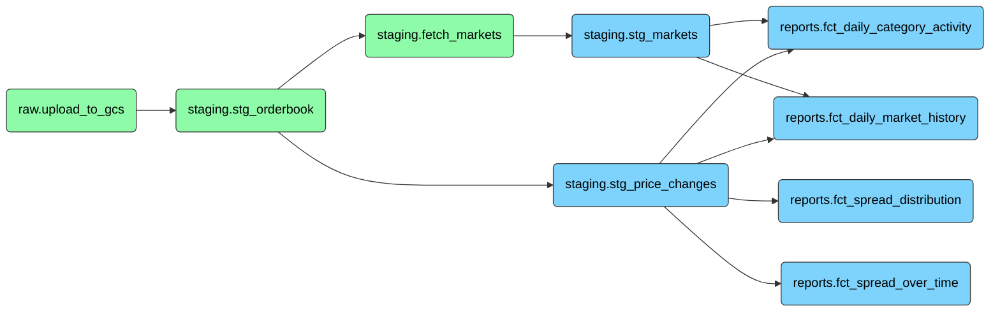

# polymarket-pipeline

Bruin pipeline definition for the **Polymarket Pipeline** project. This folder contains all pipeline assets, the pipeline configuration, and is the argument passed to `bruin run` at execution time.

---

## Structure

```
polymarket-pipeline/
├── assets/
│   ├── ingestion/
│   │   └── upload_to_gcs.py               # Streams hourly Parquet files from pmxt → GCS
│   ├── staging/
│   │   ├── stg_orderbook.py               # Loads GCS Parquet partitions → BigQuery
│   │   ├── stg_price_changes.asset.sql    # Parses JSON payload, derives spread
│   │   ├── fetch_markets.py               # Fetches market metadata from Gamma API
│   │   └── stg_markets.asset.sql          # Cleansed dimension view over dim_markets
│   ├── reports/
│   │   ├── fct_spread_over_time.asset.sql
│   │   ├── fct_spread_distribution.asset.sql
│   │   ├── fct_daily_category_activity.asset.sql
│   │   └── fct_daily_market_history.asset.sql
│   └── scripts/
│       └── check_parquet_files.py         # Utility: validate GCS Parquet magic bytes
└── pipeline.yml                           # Schedule, start_date, default connection
```

---

## Pipeline configuration

`pipeline.yml` defines the schedule and default BigQuery connection used by all SQL assets:

```yaml
name: polymarket-pipeline
schedule: daily
start_date: "2026-03-14"
catchup: false

default_connections:
  google_cloud_platform: "bruin_gcp"
```

Bruin resolves `bruin_gcp` against the active environment in `.bruin.yml` at the repo root. For local runs use `--environment dev`; on the VM use `--environment prod`.

---

## DAG

Assets run in this dependency order:



`staging.fetch_markets` runs in parallel with `stg_price_changes` — both depend on `stg_orderbook` but are independent of each other. They converge at `stg_markets`, which is the join key for all four report tables.

---

## Asset reference

### `raw.upload_to_gcs`

**Type:** Python · **Image:** `python:3.12`

Streams hourly Parquet files from the pmxt archive (`https://r2.pmxt.dev/polymarket_orderbook_{YYYY-MM-DDTHH}.parquet`) into GCS at `gs://polymarket-raw-parquet/raw/orderbook/date={date}/{hour}.parquet`.

- Idempotent: skips blobs that already exist
- Concurrent: up to 4 parallel uploads
- Blocking: exits non-zero if any slot fails, preventing downstream assets from running on incomplete data
- Supports both single-day runs and multi-day backfills via `BRUIN_START_DATE` / `BRUIN_END_DATE`

---

### `staging.stg_orderbook`

**Type:** Python · **Image:** `python:3.12` · **Depends on:** `raw.upload_to_gcs`

Loads raw Parquet files from GCS into `staging.stg_orderbook` using BigQuery's `LOAD DATA INTO ... OVERWRITE PARTITIONS`. One partition per date.

- Grain: one row per token per orderbook event — binary markets produce ~2x rows per event (YES + NO sides)
- Partitioned by `DATE(timestamp_received)`, clustered by `market_id, update_type`
- Partition-level idempotent: re-running the same date atomically replaces the partition
- Supports multi-day backfills without any external state

---

### `staging.stg_price_changes`

**Type:** BigQuery SQL · **Depends on:** `staging.stg_orderbook`

Parses the raw JSON `data` column using `JSON_VALUE()`, casts all fields to their correct types, and derives `spread = best_ask - best_bid`. Filters to `update_type = 'price_change'` only.

- Grain: one row per token per price_change event — book_snapshot rows excluded
- Partitioned by `date`, clustered by `market_id`
- Incremental strategy: `delete+insert` on `date`
- Data quality guards: probability bounds `[0, 1]`, side allowlist `{YES, NO}`, inverted market filter `ask >= bid`

---

### `staging.fetch_markets`

**Type:** Python · **Image:** `python:3.12` · **Depends on:** `staging.stg_orderbook`

Fetches market metadata from the Polymarket Gamma API (`https://gamma-api.polymarket.com/markets`) for all market IDs present in `stg_orderbook` that do not yet exist in `dim_markets`.

- Concurrent: 8 threads, batches of 20 market IDs per request
- Category resolution: canonical priority list of 8 known tag IDs; falls back to first non-rewards tag label
- Ghost markets: IDs the API cannot resolve are written as `is_ghost = TRUE` to preserve referential integrity downstream
- Upsert pattern: temp table → `MERGE` into `dim_markets` (insert-only, existing rows are never overwritten)

---

### `staging.dim_markets`

**Type:** BigQuery table · **Populated by:** `staging.fetch_markets`

Dimension table of market metadata. One row per `market_id`. Insert-only — existing rows are never overwritten. Ghost markets (`is_ghost = TRUE`) are included here but filtered out in `stg_markets`. Never query this directly downstream; use `stg_markets` instead.

---

### `staging.stg_markets`

**Type:** BigQuery SQL view · **Depends on:** `staging.fetch_markets`

Cleansed view over `staging.dim_markets`. Filters out ghost markets and applies `COALESCE` defaults for all nullable categorical fields. Serves as the primary join key for all four report assets.

---

### `reports.fct_spread_over_time`

**Type:** BigQuery SQL · **Depends on:** `staging.stg_price_changes`

Hourly time-series of average spread, spread standard deviation, YES bid/ask averages, and tick count. Partitioned by `date`, clustered by `hour`. Drives the intraday spread line chart in Looker Studio.

---

### `reports.fct_spread_distribution`

**Type:** BigQuery SQL · **Depends on:** `staging.stg_price_changes`

Buckets spreads into three quality tiers per day:

| Tier | Condition |
|---|---|
| `1. Tight (< $0.02)` | `spread <= 0.02` |
| `2. Medium ($0.02 - $0.05)` | `spread <= 0.05` |
| `3. Wide (> $0.05)` | `spread > 0.05` |

Prefixed with `1.`, `2.`, `3.` to force correct sort order in Looker Studio. Partitioned by `date`. Powers the 100% stacked bar chart.

---

### `reports.fct_daily_category_activity`

**Type:** BigQuery SQL · **Depends on:** `staging.stg_price_changes`, `staging.stg_markets`

Daily aggregation of distinct market count, tick volume, and average spread grouped by category. Partitioned by `date`, clustered by `category`.

---

### `reports.fct_daily_market_history`

**Type:** BigQuery SQL · **Depends on:** `staging.stg_price_changes`, `staging.stg_markets`

Daily snapshot per individual market: YES token price action (`avg_bid`, `avg_ask`, `min_bid`, `max_ask`), spread volatility (`STDDEV`), and a Pearson correlation of YES bid price against `UNIX_SECONDS(timestamp_received)` as a sentiment proxy (`+1` = strong YES trend, `-1` = strong NO trend). Partitioned by `date`, clustered by `category, market_id`.

---

## Running the pipeline

### Full run for a single date

```bash
bruin run ./polymarket-pipeline \
  --start-date 2026-03-14 \
  --end-date 2026-03-15 \
  --environment dev
```

### Backfill over multiple days

```bash
bruin run ./polymarket-pipeline \
  --start-date 2026-03-14 \
  --end-date 2026-03-20 \
  --environment dev
```

### Single asset

```bash
bruin run ./polymarket-pipeline/assets/ingestion/upload_to_gcs.py \
  --start-date 2026-03-14 \
  --end-date 2026-03-15 \
  --environment dev
```

### Validate without running

```bash
bruin validate ./polymarket-pipeline
```

> **Important Execution Notes**:
> - **First-Time Runs:** If this is the very first time the pipeline is running (and the target BigQuery tables do not exist yet), append the `--full-refresh` flag to the end of your command.
> - **Docker & Production Environments:** If you adapt these commands to run inside a Docker container using `--environment prod`, Bruin will trigger a safety confirmation prompt. You must include the `-it` flag in your `docker run` command (e.g., `docker run --rm -it ...`) so you can interactively type `y` to confirm.

---

## Data quality checks

Every asset defines both column-level checks and custom SQL checks that run after materialization. All checks are scoped to `[start_date, end_date)` to avoid full-table scans.

**Blocking checks** halt the pipeline on failure, preventing downstream assets from consuming incomplete data. Examples:

- `stg_orderbook`: no empty partitions after load; no nulls or invalid `update_type` values
- `stg_price_changes`: no rows with probability bounds violated or inverted spreads
- `fetch_markets`: no null `market_id` values; `dim_markets` is not empty after merge
- All report tables: target partitions are not empty after materialization

**Non-blocking checks** emit warnings without stopping the run. Examples:

- `stg_orderbook`: both `price_change` and `book_snapshot` update types are present
- `fetch_markets`: ghost market ratio does not exceed 10%
- `fct_spread_distribution`: no more than 3 distinct tiers per day

---

## Environment variables injected by Bruin

These are available inside every Python asset at runtime:

| Variable | Description |
|---|---|
| `BRUIN_START_DATE` | ISO timestamp for the start of the run window |
| `BRUIN_END_DATE` | ISO timestamp for the end of the run window |
| `bruin_gcp` | JSON string containing the GCP service account credentials |